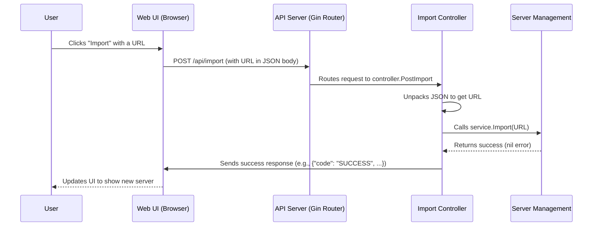

# Chapter 3: API Server & Controllers

In the [previous chapter](02_server___subscription_management_.md), we became librarians, learning how v2rayA manages its inventory of servers and subscriptions. We saw the Go functions like `Import` and `UpdateSubscription` that do the heavy lifting. But this raises a question: how does your click on a button in a web browser, which could be thousands of miles away from the server running v2rayA, actually trigger these functions?

Welcome to the command center's communication hub. This is where the user interface (the pilot) talks to the backend engine.

Think of the v2rayA backend as a powerful but windowless engine room. It can do many things, but it needs instructions. The **API Server** is the set of communication panels and buttons installed on the outside, and the **Controllers** are the operators who read the button presses and relay the commands to the engine room.

In this chapter, we'll explore how the v2rayA web page sends signals and how the backend receives and understands them.

## The Journey of a Click

Let's use a simple example we're already familiar with: adding a new server.

1.  **You:** You paste a server link (e.g., `vmess://...`) into the web UI and click the "Import" button.
2.  **The Signal (HTTP Request):** Your web browser creates a digital message, an "HTTP Request." This message is addressed to a specific endpoint on the v2rayA backend, something like `/api/import`. The message also carries the server link as its payload.
3.  **The Listener (API Server):** The v2rayA backend is constantly listening for these messages on a specific network address and port. This listener is a web server.
4.  **The Operator (Controller):** When a message arrives at `/api/import`, a specific function—the `PostImport` controller—is activated. Its job is to handle this exact type of request.
5.  **Executing the Command:** The controller opens the message, takes out the server link, and passes it to the `service.Import` function we learned about in the last chapter.
6.  **The Reply:** Once the service is done, the controller sends a "Success" or "Failure" message back to your browser, which then updates the UI to show you the new server or an error message.

This entire system ensures that the user interface (what you see) is neatly separated from the business logic (what the app does).

## The Listener: The Gin Web Server and its Router

v2rayA uses a very popular Go library called **Gin** to build its web server. Gin makes it easy to create an API by defining "routes." A route is simply a rule that maps a URL path and a request method (like GET for fetching data or POST for submitting data) to a specific handler function.

This "map" is defined in `service/server/router/index.go`.

```go
// File: service/server/router/index.go

func Run() error {
	engine := gin.New()
	// ... (setup code) ...

	// All API routes will start with "/api"
	auth := engine.Group("api", /*...some checks...*/ )
	{
		// If a POST request arrives at "/api/import",
		// call the PostImport function from the controller package.
		auth.POST("import", controller.PostImport)

		// If a POST request arrives at "/api/connection",
		// call the PostConnection function.
		auth.POST("connection", controller.PostConnection)

		// If a DELETE request arrives at "/api/connection",
		// call the DeleteConnection function.
		auth.DELETE("connection", controller.DeleteConnection)
	}

	// ... (start the server) ...
	return engine.Run(...)
}
```

Think of this code as a telephone switchboard. `engine.Group("api", ...)` says, "All calls starting with 'api' are for us." Then, `auth.POST("import", ...)` says, "If the call is a POST to the 'import' extension, connect them to the `PostImport` operator."

This file is the single entry point for all communication from the web UI. It directs traffic to the correct controller.

## The Operator: The Controller Functions

Now let's meet the operator. Controllers are the functions that actually handle the incoming requests. They live in the `service/server/controller/` directory.

Their job is simple and follows a clear pattern:
1.  **Unpack the request:** Read the data sent by the browser.
2.  **Validate the data:** Make sure the data is in the correct format.
3.  **Call the service:** Pass the data to the appropriate function in the `service` layer to do the real work.
4.  **Send a response:** Tell the browser whether the operation succeeded or failed.

Let's look at our `PostImport` controller.

```go
// File: service/server/controller/import.go

func PostImport(ctx *gin.Context) {
	// 1. Define a place to put the incoming data.
	//    We expect a JSON object with a "url" field.
	var data struct {
		URL string `json:"url"`
	}

	// 2. Unpack the request's JSON body into our `data` struct.
	err := ctx.ShouldBindJSON(&data)
	if err != nil {
		// If it fails, send an error back.
		common.ResponseError(ctx, logError("bad request"))
		return
	}

	// 3. Call the logic from Chapter 2.
	err = service.Import(data.URL, nil)
	if err != nil {
		common.ResponseError(ctx, logError(err))
		return
	}

	// 4. Send a success response. `getTouch` is a helper
	//    that sends back the latest application status.
	getTouch(ctx)
}
```

This function is the perfect "middleman." It doesn't know *how* to import a server, and it doesn't know *how* to send an HTTP response. It just knows how to connect the two. It takes the `data.URL` from the request and hands it to `service.Import`, then takes the result and hands it to a response function.

### A Quick Word on Responses

You might have noticed the `common.ResponseError` function. v2rayA uses a standard format for all its API responses to make life easier for the frontend.

```go
// File: service/common/response.go

func ResponseError(ctx *gin.Context, err error) {
	// This creates a JSON response like:
	// { "code": "FAIL", "message": "your error message here", "data": null }
	Response(ctx, FAIL, err.Error())
}

func ResponseSuccess(ctx *gin.Context, data interface{}) {
	// This creates a JSON response like:
	// { "code": "SUCCESS", "message": null, "data": { ... your data ... } }
	Response(ctx, SUCCESS, data)
}
```

This consistent structure allows the web UI to easily check if `code` is `SUCCESS` or `FAIL` and act accordingly.

## The Full Picture

Let's trace the journey of that "Import" click again, now with our newfound knowledge.



This clean separation of concerns is a hallmark of good software design.
-   The **Router** only cares about URLs.
-   The **Controller** only cares about connecting HTTP to the service layer.
-   The **Service** only cares about the application's business logic (like adding a server).
-   The [**Data Persistence**](01_data_persistence___configuration_model_.md) layer only cares about reading from and writing to the database.

Each component has one job and does it well.

## Conclusion

In this chapter, we've wired up the control panel for our v2rayA engine.

-   **API Server:** v2rayA runs a web server using Gin that listens for commands from the web UI.
-   **Router:** The router (`router/index.go`) acts as a switchboard, directing incoming requests to the correct handler based on the URL.
-   **Controllers:** These are the handler functions (`controller/*.go`) that act as middlemen. They parse requests, call the appropriate backend services, and formulate a response.
-   **Separation of Concerns:** This architecture cleanly separates the web communication layer from the core application logic, making the code easier to understand, maintain, and test.

Now we understand how a user can click "Connect" and tell the backend to do so. But what actually happens then? The backend needs to take that server information, generate a valid configuration file, and start the core V2Ray process. That's our next topic.

Next: [Chapter 4: V2Ray Core Process Management](04_v2ray_core_process_management_.md)

---

Generated by [AI Codebase Knowledge Builder](https://github.com/The-Pocket/Tutorial-Codebase-Knowledge)