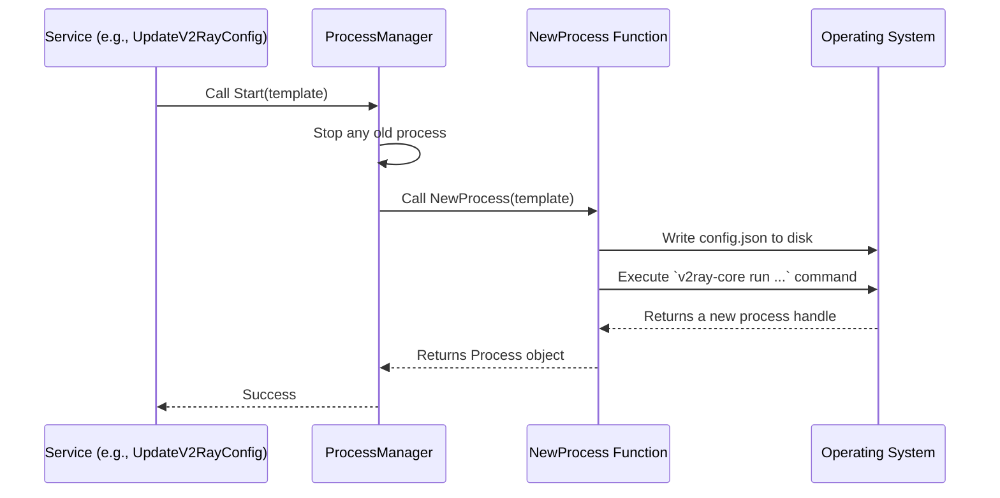

# Chapter 4: V2Ray Core Process Management

In our [previous chapter](03_api_server___controllers_.md), we saw how a click in the web UI becomes a command sent to the v2rayA backend. We now know how the "Connect" signal reaches the application's brain. But what happens next? How does v2rayA actually establish a proxy connection?

This is where we meet the engine room. v2rayA itself is like the captain on the bridge of a ship—it gives orders, manages the crew (your server list), and sets the course (your settings). But it doesn't *personally* power the ship. The powerful engine deep in the hull does that.

For v2rayA, that engine is an external program called **`v2ray-core`**. This chapter is about how v2rayA acts as the ship's engineer, responsible for starting, stopping, and monitoring this core engine.

## The Manager, Not the Doer

A crucial concept to understand is that **v2rayA does not implement proxy protocols like VLESS or Shadowsocks itself.** It delegates that heavy lifting to the specialized and highly optimized `v2ray-core` program.

v2rayA's job is to be a brilliant manager:
*   It takes your chosen server and settings.
*   It writes a configuration file that `v2ray-core` can understand.
*   It starts the `v2ray-core` process with that configuration.
*   It ensures the process keeps running smoothly.
*   When you disconnect, it cleanly shuts the process down.

This entire responsibility is handled by a single, global component called the **`ProcessManager`**.

## The ProcessManager: The Engine's Ignition Switch

Think of the `ProcessManager` as the ignition system of a car. It's the one thing that can start or stop the engine. In v2rayA, this is represented by a global variable that keeps track of the `v2ray-core` engine's state.

```go
// File: service/core/v2ray/processManager.go

// ProcessManager is a global variable that manages the v2ray-core process.
var ProcessManager CoreProcessManager

type CoreProcessManager struct {
	p  *Process // 'p' holds the currently running process, or is nil if stopped.
	mu sync.Mutex // A lock to prevent multiple commands at once.
}
```
This is the heart of our chapter. The `ProcessManager` knows one simple thing: is the engine (`p`) running or not? All actions to start or stop the proxy flow through this single point.

## Starting the Engine: From Click to Connection

Let's follow the journey of connecting to a server. We know from the previous chapter that the UI click eventually calls a function in the backend. In this case, it's often a function called `UpdateV2RayConfig`.

This function acts as a high-level coordinator.

```go
// File: service/core/v2ray/process.go

func UpdateV2RayConfig() (err error) {
	// 1. Prepare a "blueprint" for the v2ray-core config.
	tmpl, err := NewTemplateFromConnectedServers(nil)
	if err != nil {
		// If no servers are selected, stop the core.
		if errors.Is(err, NoConnectedServerErr) {
			ProcessManager.Stop(true)
			return nil
		}
		return err
	}

	// 2. Tell the manager to start the engine with this new blueprint.
	err = ProcessManager.Start(tmpl)
	return
}
```
This function does two main things:
1.  It gathers all the necessary information (which servers you've connected, what your settings are) and creates a configuration "template." We'll dive deep into this in the [next chapter](05_configuration_generation__v2raytemplate__.md).
2.  It hands this template over to our `ProcessManager` and says, "Start the engine using these instructions."

Now, let's look at the `Start` method on our `ProcessManager`.

```go
// File: service/core/v2ray/processManager.go

func (m *CoreProcessManager) Start(t *Template) (err error) {
	m.mu.Lock()
	defer m.mu.Unlock()

	// 1. First, stop any old engine that might still be running.
	m.stop(true)

	// 2. Create and start a new process with the given template.
	process, err := NewProcess(t, /*...hooks...*/)
	if err != nil {
		return err
	}

	// 3. Remember that this new process is now the active one.
	m.p = process
	return nil
}
```
This code is like a checklist for starting a car:
1.  Make sure the engine is off before trying to start it again (`m.stop`).
2.  Turn the key (`NewProcess`). This is the complex step where the real work happens.
3.  Once the engine is running, remember that fact (`m.p = process`).

## Under the Hood: The `NewProcess` Function

The `ProcessManager.Start` method delegates the messy, low-level work of actually running an external program to a helper function: `NewProcess`. Here's what it does step-by-step:

1.  **Write the Config:** It takes the `Template` and writes a `config.json` file to disk.
2.  **Find the Executable:** It locates the `v2ray-core` program file on your computer.
3.  **Run the Command:** It uses Go's built-in `os/exec` package to execute a command in your terminal, equivalent to you typing: `v2ray run --config=/path/to/v2raya/config.json`.
4.  **Monitor:** It watches the new process to make sure it started up without errors and is ready to accept traffic.

Here is a diagram of the flow:



The most critical piece of code is where the external program is actually launched.

```go
// File: service/core/v2ray/process.go (Simplified)

func StartCoreProcess(ctx context.Context) (*os.Process, error) {
	// Find where the v2ray-core program is.
	v2rayBinPath, err := where.GetV2rayBinPath()
	if err != nil { return nil, err }

	// Prepare the command line arguments.
	arguments := []string{
		v2rayBinPath,
		"run",
		"--config=" + asset.GetV2rayConfigPath(),
	}

	// Create a command object.
	cmd := exec.CommandContext(ctx, v2rayBinPath, arguments...)
	
	// Start the command! This is non-blocking.
	err = cmd.Start()
	return cmd.Process, err
}
```
This snippet uses Go's standard library to find and execute `v2ray-core`. It's the bridge between v2rayA's Go world and the external `v2ray-core` process.

## Stopping the Engine

Stopping is just as important as starting. You need to shut down the engine cleanly. This is handled by the `ProcessManager.Stop` method, which in turn calls `Close()` on the active process.

```go
// File: service/core/v2ray/process.go

// The Process struct holds a special 'cancel' function.
type Process struct {
	proc       *os.Process
	procCancel func() // This function, when called, stops the process.
	// ...
}

func (p *Process) Close() error {
	p.mutex.Lock()
	defer p.mutex.Unlock()

	if p.procCancel != nil {
		// Calling this function sends a signal to the running
		// v2ray-core process, telling it to shut down.
		p.procCancel()
		p.procCancel = nil
	}
	return nil
}
```
When `NewProcess` starts `v2ray-core`, it uses a feature of Go called `context.WithCancel`. This creates a special `cancel` function. Calling this function is like sending a polite "please shut down now" message to the `v2ray-core` process, allowing it to terminate gracefully instead of being forcefully killed.

## Conclusion

In this chapter, we've pulled back the curtain on v2rayA's most fundamental abstraction: it's a manager, not a proxy implementation.

-   **The Engine:** `v2ray-core` is the external program that does all the actual proxying work.
-   **The Engineer:** v2rayA's `ProcessManager` is responsible for the entire lifecycle of the `v2ray-core` process.
-   **Lifecycle Management:** The `Start` and `Stop` methods provide a clean interface to control the engine. `Start` uses `os/exec` to run `v2ray-core`, and `Stop` uses a context `cancel` function to terminate it gracefully.
-   **Separation of Duties:** This design allows v2rayA to focus on providing a great user experience and management interface, while leaving the complex, high-performance proxy logic to the specialized `v2ray-core` team.

We've mentioned that starting the process requires a `config.json` file created from a "template." But how does v2rayA generate this file based on the servers you've added and the settings you've chosen? That's the puzzle we'll solve next.

Next: [Chapter 5: Configuration Generation (V2RayTemplate)](05_configuration_generation__v2raytemplate__.md)

---

Generated by [AI Codebase Knowledge Builder](https://github.com/The-Pocket/Tutorial-Codebase-Knowledge)