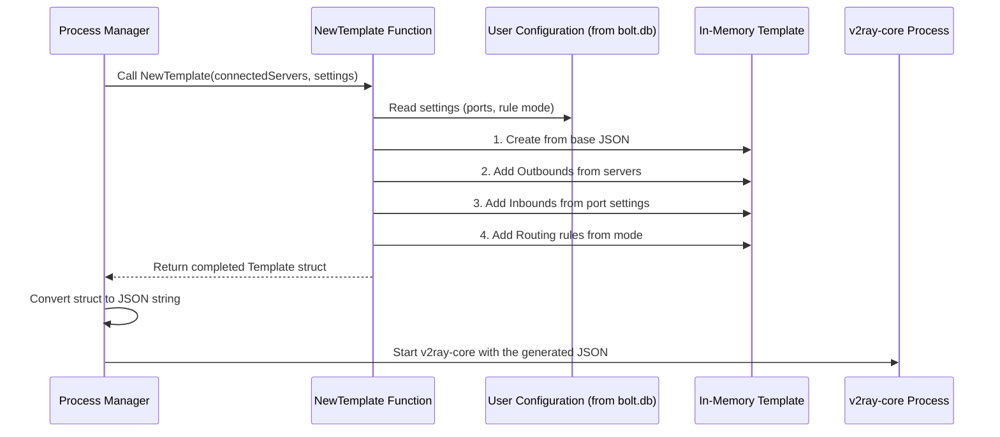

# Chapter 5: Configuration Generation (V2RayTemplate)

In the [previous chapter](04_v2ray_core_process_management_.md), we learned how v2rayA acts as an engineer, starting and stopping the powerful `v2ray-core` engine. We saw that to start the engine, v2rayA must first provide it with a `config.json` file. But how is this crucial file created?

Think about it: in the v2rayA interface, you perform simple actions like selecting a server, choosing "Whitelist Mode," or enabling an anti-DNS-pollution feature. The `v2ray-core` engine, however, doesn't understand these high-level concepts. It only understands a very specific, detailed, and often complex JSON format.

This is where v2rayA's "master translator" comes in. The **V2RayTemplate** system takes all your user-friendly settings and translates them into the precise, technical instructions that `v2ray-core` needs to function.

Imagine you're at a high-tech restaurant. You give your waiter a simple order: "I'll have the steak, medium-rare, with a side of potatoes." The waiter (`v2rayA`) doesn't just shout this to the kitchen. Instead, they write a detailed ticket for the expert chefs (`v2ray-core`): "Filet Mignon, cook to internal temp 135°F, rest 5 mins. Sauté 200g Russet potatoes in clarified butter with rosemary..."

This chapter explores how v2rayA writes that detailed "kitchen ticket."

## The Blueprint: The Base Template

Every great configuration starts with a solid foundation. v2rayA has a built-in skeleton for the `config.json` file. It's like a pre-printed form with empty sections for "Inbounds," "Outbounds," and "Routing."

This skeleton is stored as a simple string in `service/core/v2ray/templateJson.go`.

```go
// File: service/core/v2ray/templateJson.go

const TemplateJson = `
{
    "inbounds": [
        // ... some default inbound definitions ...
    ],
    "outbounds": [],
    "routing": {
        "domainStrategy": "IPOnDemand",
        "rules": []
    }
}`
```

This is our starting point. It's a valid, but mostly empty, `v2ray-core` configuration. The goal of our translator is to fill in the `outbounds` and `routing.rules` arrays with your specific servers and rules.

## The In-Memory "Form": The `Template` Struct

To fill out this form, v2rayA first loads it into a Go `struct`. This struct, defined in `service/core/v2ray/v2rayTmpl.go`, is an in-memory representation of the configuration. It's much easier to work with than raw text.

```go
// File: service/core/v2ray/v2rayTmpl.go

type Template struct {
	// ... (other fields like Log, DNS) ...
	Inbounds  []coreObj.Inbound        `json:"inbounds"`
	Outbounds []coreObj.OutboundObject `json:"outbounds"`
	Routing   struct {
		Rules []coreObj.RoutingRule `json:"rules"`
		// ...
	} `json:"routing"`
	
	// Internal fields not written to JSON
	Setting *configure.Setting `json:"-"` 
}
```

Think of this `Template` struct as the digital version of our pre-printed form. Now we can programmatically add servers to the `Outbounds` list and rules to the `Routing.Rules` list.

## The Master Chef: The `NewTemplate` Function

The main entry point for all this translation magic is the `NewTemplate` function. This is our master chef. It takes all the raw ingredients—your connected servers and application settings—and orchestrates the entire process of building the final configuration.

```go
// File: service/core/v2ray/v2rayTmpl.go

// NewTemplate creates a full v2ray-core configuration from user settings.
func NewTemplate(serverInfos []serverInfo, setting *configure.Setting) (t *Template, err error) {
	// 1. Start with the base JSON template.
	// ...

	// 2. Resolve outbounds from the list of connected servers.
	// ...

	// 3. Set up inbounds based on port settings.
	// ...

	// 4. Set up DNS based on anti-pollution settings.
	// ...

	// 5. Generate and add routing rules based on the selected mode (GFWList, etc.).
	// ...

	// 6. Return the completed template.
	return t, nil
}
```

Let's break down these steps.

### Step 1: Translating Servers into "Outbounds"

The first task is to translate the servers you've chosen to connect with into `v2ray-core` "outbound" objects. An outbound tells `v2ray-core` *how* to send traffic out to the internet.

This is handled by the `resolveOutbounds` helper function. It loops through your selected servers and converts each one into a valid outbound configuration block.

For example, a VLESS server you added gets turned into something like this:

```json
// Example of a single outbound object in the final config
{
    "protocol": "vless",
    "tag": "proxy",
    "settings": {
        "vnext": [
            {
                "address": "your.server.com",
                "port": 443,
                "users": [
                    { "id": "your-uuid", "encryption": "none" }
                ]
            }
        ]
    },
    "streamSettings": {
        // ... (TLS, WebSocket, etc. settings) ...
    }
}
```

This JSON block is added to the `Outbounds` list in our `Template` struct.

### Step 2: Translating Settings into "Inbounds"

Next, v2rayA needs to tell `v2ray-core` which local ports to listen on. These are called "inbounds." It reads your port settings (e.g., SOCKS5 on port 20170) from the [Data Persistence & Configuration Model](01_data_persistence___configuration_model_.md) and creates inbound objects.

The `setInbound` function handles this.

```go
// File: service/core/v2ray/v2rayTmpl.go (Simplified logic)

func (t *Template) setInbound(setting *configure.Setting) error {
	// Get the port settings from the database
	p := configure.GetPortsNotNil()

	// Find the inbound with the tag "socks" and set its port
	t.Inbounds[0].Port = p.Socks5 // e.g., 20170

	// Find the inbound with the tag "http" and set its port
	t.Inbounds[1].Port = p.Http // e.g., 20171

	// ... and so on for other ports ...
	return nil
}
```

### Step 3: Translating Rules into "Routing"

This is perhaps the most complex translation. A simple choice like "Whitelist Mode" needs to be converted into a series of very specific routing rules.

The `AppendRoutingRuleByMode` function is the expert here. If you select "Whitelist Mode," it adds rules that say:
*   If the destination domain is in China (`geosite:cn`), send it directly (`direct`).
*   If the destination IP is in China (`geoip:cn`), send it directly.
*   Otherwise, send it through the proxy.

This translates into JSON rules like this:

```json
// Example of routing rules in the final config
{
    "type": "field",
    "outboundTag": "direct",
    "domain": ["geosite:cn"]
},
{
    "type": "field",
    "outboundTag": "direct",
    "ip": ["geoip:cn", "geoip:private"]
},
{
    "type": "field",
    "outboundTag": "proxy",
    "port": "0-65535"
}
```

These rules are appended to the `Routing.Rules` list in our `Template` struct.

## The Full Generation Process

Let's visualize the entire flow from a "Connect" command to a ready-to-use configuration file.



This process happens every time you connect, disconnect, or change a setting that affects the core connection. It ensures that `v2ray-core` is always running with a configuration that perfectly matches your intent.

## Conclusion

In this chapter, we've unveiled the "master translator" that sits at the heart of v2rayA.

-   **The Goal:** To translate high-level user settings into the complex JSON configuration that `v2ray-core` requires.
-   **The Process:** It starts with a base template, then programmatically fills it out with outbounds (from servers), inbounds (from port settings), and routing rules (from modes like Whitelist/GFWList).
-   **The Key Function:** `NewTemplate` in `v2rayTmpl.go` is the orchestrator, calling various helper functions to perform each part of the translation.
-   **The Outcome:** A complete, in-memory `Template` struct that is ready to be converted to JSON and fed to the `v2ray-core` engine.

We've seen how rules for modes like "Transparent Proxy" are generated and put into the configuration. But simply having the rule isn't enough. How does v2rayA actually capture all your computer's network traffic and redirect it to itself for processing? That's the advanced magic we'll uncover in the next chapter.

Next: [Chapter 6: Transparent Proxy & System Routing](06_transparent_proxy___system_routing_.md)

---

Generated by [AI Codebase Knowledge Builder](https://github.com/The-Pocket/Tutorial-Codebase-Knowledge)