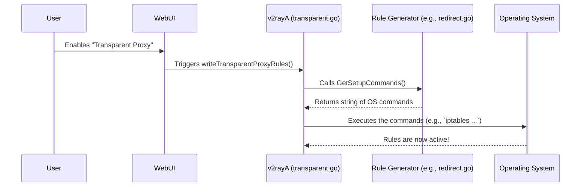

# Chapter 6: Transparent Proxy & System Routing

In the [previous chapter](05_configuration_generation__v2raytemplate__.md), we became master chefs, learning how v2rayA translates your simple settings into a detailed `config.json` "recipe" for the `v2ray-core` engine. A key part of that recipe was the "routing rules," which decide what traffic goes through the proxy and what goes direct.

But this raises a big question: how does traffic from *all* your applications—your web browser, your music streaming app, your video games—even get to v2rayA to be inspected in the first place? You didn't configure each of them separately, so how do they know to send their traffic to v2rayA?

Welcome to v2rayA's traffic control center. This is where v2rayA goes beyond being just an application and starts managing your computer's core networking behavior.

## The Problem: One Proxy, Many Applications

Imagine you have a new, super-fast private toll road (your proxy). If you want to use it, you need to tell every car (every application) to exit the public highway and get onto your private road. This is a lot of work! You'd have to go into your browser settings, your system update settings, your game launcher settings... it's a nightmare.

Wouldn't it be easier to just place a traffic cop at the main highway intersection and have them redirect all traffic onto your private road automatically?

This is exactly what **Transparent Proxy** does. It sets up system-level rules that transparently—meaning the applications don't even know it's happening—redirect all (or some) of your computer's network traffic through v2rayA.

## The Tools of Traffic Control

v2rayA doesn't have magical powers to do this. Instead, it acts as a smart and user-friendly "foreman" that directs the powerful, built-in tools of your operating system.

*   **On Linux:** v2rayA uses command-line utilities like `iptables` or `nftables`. These are powerful firewalls that can create sophisticated rules to intercept and redirect network packets.
*   **On Windows:** v2rayA modifies the Windows Registry and system network settings to set a "system-wide proxy."
*   **On macOS:** v2rayA uses a command-line tool called `networksetup` to configure the proxy settings for all your network services (like Wi-Fi and Ethernet).

The beauty of v2rayA is that you, the user, just click one button. v2rayA figures out which OS it's on and uses the correct tools to get the job done.

## The Journey of a Packet

Let's see what happens when you have Transparent Proxy enabled and you try to visit a website.

1.  **Request:** Your browser tries to open a connection to `google.com`.
2.  **Interception:** Before the request leaves your computer, the Operating System's network stack checks its rules.
3.  **Redirection:** It finds a rule that v2rayA created. The rule says: "Any outgoing TCP connection should be rerouted to `localhost` on port `52345`".
4.  **Processing:** The request is sent not to `google.com`, but to v2rayA's `v2ray-core` process, which is listening on port `52345`.
5.  **Proxying:** The `v2ray-core` process receives the request, checks its *own* routing rules (from the `config.json` we made in the last chapter), and sends it out through the correct proxy server.

The application (your browser) is completely unaware of steps 2, 3, and 4. As far as it's concerned, it just connected to `google.com`. The proxying was *transparent*.

## How v2rayA Builds the Rules

When you flip the "Transparent Proxy" switch in the UI, it triggers a chain of events that ends with system networking rules being changed. The main entry point for this is the `writeTransparentProxyRules` function.

```go
// File: service/core/v2ray/transparent.go

func writeTransparentProxyRules() (err error) {
	// ... (some initial setup) ...
	
	// Get the user's settings from the database
	setting := configure.GetSettingNotNil()
	
	// Check which mode the user selected
	switch setting.TransparentType {
	case configure.TransparentRedirect:
		// For Linux "Redirect" mode
		err = iptables.Redirect.GetSetupCommands().Run(true)

	case configure.TransparentSystemProxy:
		// For Windows/macOS "System Proxy" mode
		err = iptables.SystemProxy.GetSetupCommands().Run(true)
	
	// ... (other modes like Tproxy and Tun) ...
	}
	return
}
```

This function is a high-level coordinator. It checks which specific type of transparent proxy you've chosen and then delegates the hard work to a platform-specific module.

### Example 1: Linux `Redirect` Mode

If you're on Linux and choose "Redirect" mode, the `iptables.Redirect.GetSetupCommands()` function is called. This function's job is to build a string of `iptables` commands.

```go
// File: service/core/iptables/redirect.go (Simplified)

func (r *legacyRedirect) GetSetupCommands() Setter {
	// These are commands you could type in your terminal.
	commands := `
# Create a new, custom chain of rules called "TP_RULE"
iptables -t nat -N TP_RULE

# Add a rule to our chain: redirect all TCP traffic to local port 52345
iptables -t nat -A TP_RULE -p tcp -j REDIRECT --to-ports 52345

# Finally, hook our custom chain into the system's main OUTPUT path
iptables -t nat -I OUTPUT -p tcp -j TP_RULE
`
	// Return the commands to be executed.
	return Setter{Cmds: commands}
}
```
This is the core of the magic on Linux. v2rayA constructs these text-based commands and then executes them, telling the Linux kernel how to reroute traffic.

### Example 2: macOS `System Proxy` Mode

On macOS, the approach is different. There's no `iptables`. Instead, v2rayA builds a series of `networksetup` commands.

```go
// File: service/core/iptables/systemProxy_macos.go (Simplified)

func (p *systemProxy) GetSetupCommands() Setter {
	// First, find all network connections (e.g., "Wi-Fi")
	networkServices, _ := GetNetworkServices()

	var commands string
	for _, service := range networkServices {
		// For each connection, set its Web Proxy to our local listener
		commands += fmt.Sprintf(
			"/usr/sbin/networksetup -setwebproxy %v 127.0.0.1 52345\n",
			strconv.Quote(service),
		)
	}
	return Setter{Cmds: commands}
}
```
Here, v2rayA finds your active connections (like your Wi-Fi) and runs the `networksetup` command to tell macOS: "Hey, from now on, send all web traffic for this connection to the program listening at `127.0.0.1:52345`."

## The Full Picture: From Click to System Change

Let's visualize the entire process from the user's click to the system's rules being updated.



### Don't Forget to Clean Up!

Just as important as creating the rules is removing them. When you disable Transparent Proxy or disconnect, v2rayA calls a corresponding `GetCleanCommands()` function. This function generates the commands to undo all the changes, returning your system's networking to its original state. If it didn't do this, your internet would stop working!

## Conclusion

In this chapter, we've explored one of v2rayA's most powerful features: its ability to act as a system-wide traffic controller.

-   **Transparent Proxy:** A feature that redirects network traffic from all applications without requiring individual configuration.
-   **System Routing:** v2rayA achieves this by acting as a high-level manager for low-level OS networking tools (`iptables`, `networksetup`, Windows Registry).
-   **Platform Abstraction:** The code is cleanly separated, so the main logic doesn't need to know if it's on Linux, Windows, or macOS. It just calls a standard function, and the platform-specific module handles the details.
-   **Lifecycle Management:** v2rayA is careful to both set up and tear down these system rules, ensuring your computer's networking is always in a valid state.

We've now seen how all the major parts of v2rayA work together, from storing your servers, to generating configurations, to starting the core process, and even manipulating system routing tables. But there's one last piece of the puzzle: how does the web UI know about changes in the backend *instantly*? How does your server list update right after a subscription update finishes? That is the job of a special data structure we'll explore next.

Next: [Chapter 7: `Touch` Data Structure](07__touch__data_structure_.md)

---

Generated by [AI Codebase Knowledge Builder](https://github.com/The-Pocket/Tutorial-Codebase-Knowledge)