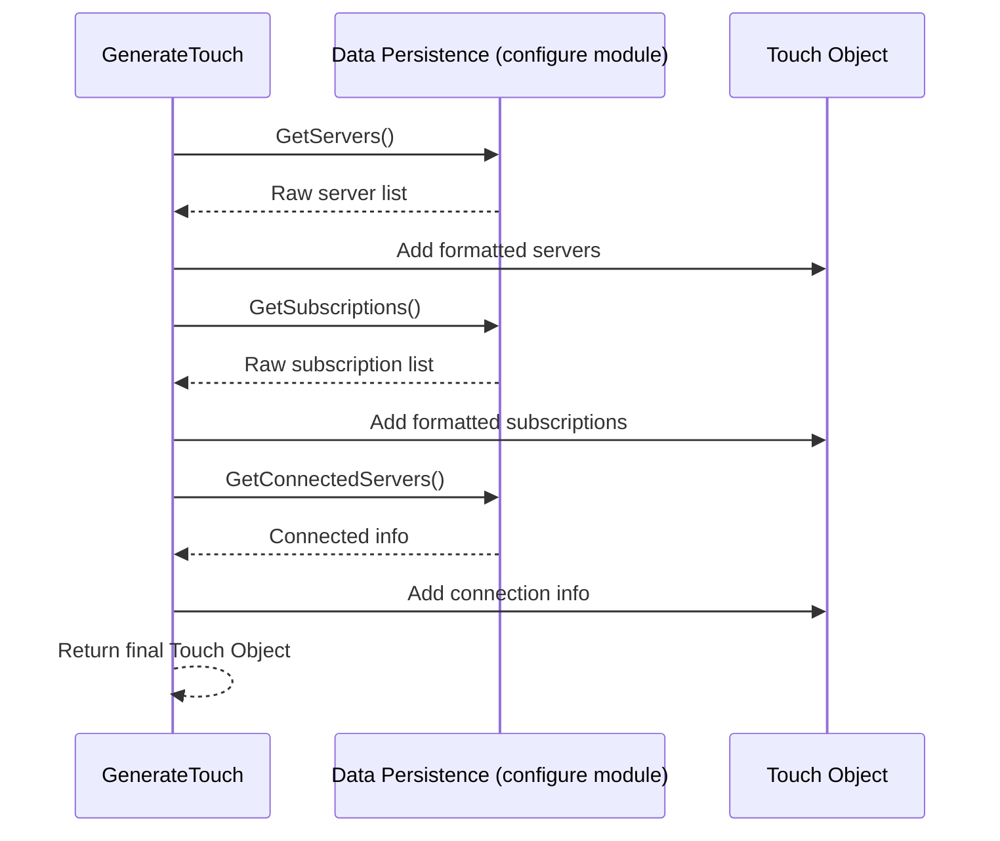
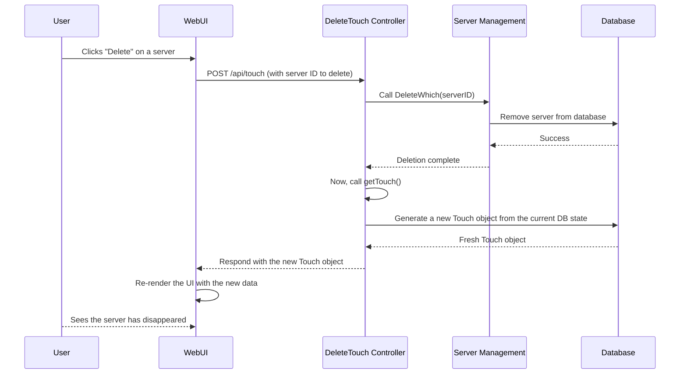

# Chapter 7: `Touch` Data Structure

In our [previous chapter on Transparent Proxy & System Routing](06_transparent_proxy___system_routing_.md), we explored how v2rayA manipulates your operating system's networking to capture traffic. We've now covered all the major backend systems. But one crucial question remains: How does the web user interface (the frontend) stay perfectly synchronized with the backend?

Imagine you update a subscription, and hundreds of new servers appear. Or you delete a server. How does the server list on your screen update instantly, without you needing to refresh the page?

Welcome to the central nervous system of v2rayA's frontend-backend communication. This is where the backend prepares a "master status report" for the frontend, ensuring the UI always has the latest, most complete picture of what's happening.

## The Problem: Keeping the UI in Sync

The v2rayA user interface is a web page running in your browser, while the logic is a Go program running on your machine. They are two separate entities. When the backend finishes a task (like updating a subscription), the UI doesn't automatically know about it.

One solution could be for the UI to constantly ask the backend, "Anything new? Anything new?". This is inefficient. A better way is for the UI to ask for a full status update whenever it needs one, especially after it initiates an action.

But what should that status update look like? Should the UI ask for the server list, then the subscription list, then the connection status in three separate requests? That would be slow and complicated.

The answer is a single, beautiful, all-encompassing data structure: the **`Touch` object**.

## The Master Status Report: The `Touch` Object

Think of the `Touch` object as a snapshot or a "family photo" of the entire application's state at a single moment in time. Whenever the UI needs to redraw itself, it asks the backend for a fresh `Touch` object. The backend gathers all the necessary information, packages it neatly into this one structure, and sends it over.

Let's look at the blueprint for this object.

```go
// File: service/core/touch/touch.go

// Touch is the top-level structure.
type Touch struct {
	Servers          []Server           `json:"servers"`
	Subscriptions    []Subscription     `json:"subscriptions"`
	ConnectedServers []*configure.Which `json:"connectedServer"`
}
```
This is the main "report." It tells us the application state consists of three key things:
1.  A list of standalone servers you've added.
2.  A list of subscriptions.
3.  Information on which server (if any) is currently connected.

Each of these has its own simple structure, designed specifically for display purposes. For example, a subscription isn't just a URL; it's an object containing its own list of servers.

```go
// File: service/core/touch/touch.go

// A Subscription in the Touch object.
type Subscription struct {
	Remarks string   `json:"remarks,omitempty"`
	ID      int      `json:"id"`
	Status  string   `json:"status"`
	// ... and most importantly, its own list of servers:
	Servers []Server `json:"servers"`
}
```
This creates a neat, tree-like structure. The UI receives this single `Touch` object and has everything it needs to render the entire page: the main server list, the expandable subscription lists, and the "connected" indicator.

## Generating the Report: The `GenerateTouch` Function

So, how is this "master report" created? The backend has a dedicated function for this job: `GenerateTouch`. This function acts like a journalist, gathering information from various sources and compiling it into the final report.

```go
// File: service/core/touch/touch.go

// GenerateTouch creates a touch object from the database.
func GenerateTouch() (t Touch) {
	// 1. Get standalone servers from the database.
	serversFromDB := configure.GetServers()
	t.Servers = serverRawsToServers(serversFromDB)

	// 2. Get subscriptions from the database.
	subscriptionsFromDB := configure.GetSubscriptions()
	
	// 3. Loop through subscriptions, converting them and their nested servers.
	for i, v := range subscriptionsFromDB {
		// ... (code to convert DB subscription to Touch subscription) ...
	}

	// 4. Get the currently connected server information.
	t.ConnectedServers = configure.GetConnectedServers().Get()

	return
}
```
The logic is straightforward:
1.  It asks the [Data Persistence & Configuration Model](01_data_persistence___configuration_model_.md) for the list of `ServerRaw` objects. It then converts them into the simpler `Server` format suitable for the UI.
2.  It does the same for subscriptions, iterating through each one and also converting its nested servers.
3.  It gets the information about which server is currently connected.
4.  It packs all of this into a single `Touch` object and returns it.

Here’s a diagram of how `GenerateTouch` works:



## Delivering the Report: The `getTouch` Controller

Now that we can generate the report, we need a way to deliver it to the UI. This is a job for the [API Server & Controllers](03_api_server___controllers_.md). Specifically, a controller function usually named `getTouch`.

```go
// File: service/server/controller/touch.go

func getTouch(ctx *gin.Context) {
	// 1. Check if the v2ray-core process is running.
	running := v2ray.ProcessManager.Running()
	
	// 2. Generate a fresh snapshot of the system state.
	t := touch.GenerateTouch()
	
	// 3. Send a success response with both pieces of information.
	common.ResponseSuccess(ctx, gin.H{
		"running": running,
		"touch":   t,
	})
}
```
This controller is the endpoint the UI calls whenever it needs a full update. It does two things:
1.  It checks the [V2Ray Core Process Management](04_v2ray_core_process_management_.md) to see if the proxy is active.
2.  It calls our `GenerateTouch` function to get the latest data.
3.  It bundles these two things into a single JSON response and sends it to the browser.

## The "Do and Report Back" Pattern

The most powerful aspect of this system is how it's used. Almost every controller that *changes* something in the backend follows a simple but effective pattern:

1.  Perform the requested action (e.g., delete a server).
2.  Call `getTouch` to generate a fresh, complete status report.
3.  Send that report back to the UI as the response to the original action.

Let's look at the `DeleteTouch` controller, which handles deleting servers or subscriptions.

```go
// File: service/server/controller/touch.go

func DeleteTouch(ctx *gin.Context) {
	// ... (code to prevent multiple operations at once) ...
	
	var ws configure.Whiches
	ctx.ShouldBindJSON(&ws) // Get which items to delete from the request.

	// 1. Perform the action: delete the items.
	service.DeleteWhich(ws.Get())

	// 2. Report back: send a fresh Touch object to the UI.
	getTouch(ctx)
}
```
This is brilliant. The UI doesn't need to guess what changed. It makes a request to delete a server. The backend deletes it, then immediately sends back a brand new, complete list of *all* servers and subscriptions. The UI simply takes this new `Touch` object and re-renders the entire page with the new data. The server it just deleted is now gone from the list. This ensures the frontend and backend are never out of sync.

Here is the complete journey:



## Conclusion

In this chapter, we've uncovered the simple yet powerful mechanism that keeps the v2rayA user interface and backend perfectly synchronized.

-   **The `Touch` Object:** A single, comprehensive, tree-like data structure that acts as a "master status report" for the UI. It contains everything needed to render the page.
-   **Generation:** The `GenerateTouch` function is responsible for creating this report by querying the database and formatting the data for easy consumption by the UI.
-   **The "Do and Report Back" Pattern:** By having API endpoints perform an action and then immediately return a fresh `Touch` object, v2rayA ensures the UI always reflects the true state of the backend with minimal effort and maximum efficiency.

We have now journeyed through the entire core architecture of v2rayA. From data persistence in `bolt.db` to managing servers, from handling API requests to starting the `v2ray-core` engine, from manipulating system routing to keeping the UI in sync. You now have a foundational understanding of how all the pieces fit together.

With this knowledge, you are well-equipped to explore the codebase, understand how features are implemented, and even begin contributing to the v2rayA project. Happy coding

---

Generated by [AI Codebase Knowledge Builder](https://github.com/The-Pocket/Tutorial-Codebase-Knowledge)