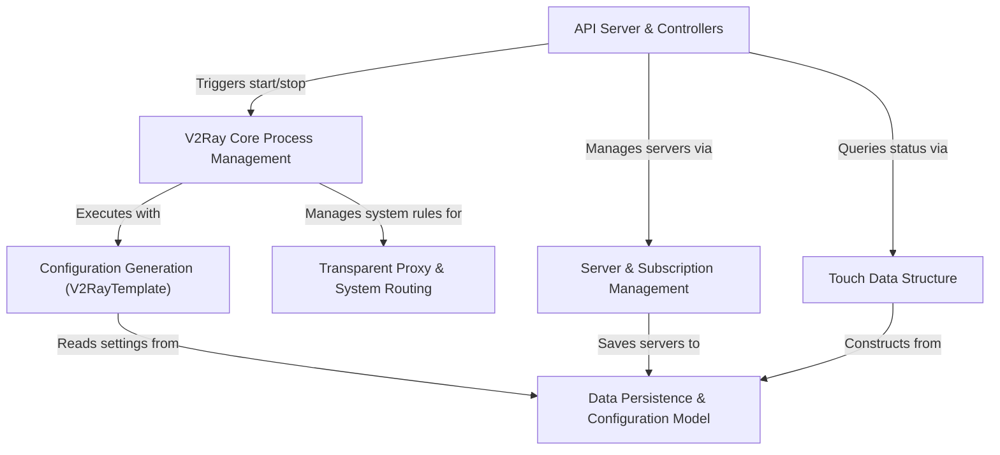

# Tutorial: v2rayA

v2rayA is a graphical user interface that helps you manage a powerful internet proxy tool called *v2ray-core*.
It simplifies the user experience by taking simple choices, like which server to connect to, and handles all the complex setup in the background. This includes **starting and stopping** the core proxy engine, automatically **updating server lists** from subscriptions, and configuring your computer to route traffic through the proxy *transparently* without needing to set up each application manually.

**Source Repository:** [v2rayA](https://github.com/v2rayA/v2rayA)

## Chapters

1. [Data Persistence & Configuration Model
](01_data_persistence___configuration_model_.md)
2. [Server & Subscription Management
](02_server___subscription_management_.md)
3. [API Server & Controllers
](03_api_server___controllers_.md)
4. [V2Ray Core Process Management
](04_v2ray_core_process_management_.md)
5. [Configuration Generation (V2RayTemplate)
](05_configuration_generation__v2raytemplate__.md)
6. [Transparent Proxy & System Routing
](06_transparent_proxy___system_routing_.md)
7. [Touch Data Structure
](07__touch__data_structure_.md)

---

Generated by [AI Codebase Knowledge Builder](https://github.com/The-Pocket/Tutorial-Codebase-Knowledge)

