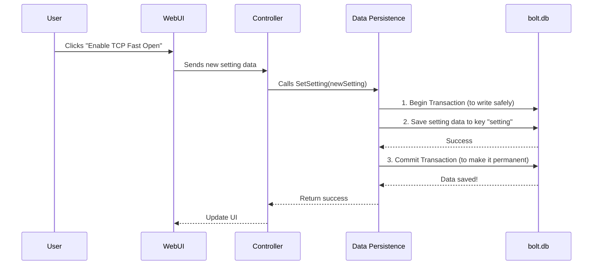

# Chapter 1: Data Persistence & Configuration Model

Welcome to the v2rayA developer's guide! If you've ever wondered how an application like v2rayA remembers all your servers, settings, and subscriptions even after you restart your computer, you've come to the right place. This chapter unpacks that very magic.

Let's start with a simple question: When you add a new server or change a setting in the v2rayA web interface, where does that information go? You wouldn't want to re-enter everything every time you open the app, right?

Think of v2rayA as having a small, dedicated notebook. Every time you make a change, it diligently writes it down. When it starts up, it reads from this notebook to restore everything exactly as you left it. This process of "remembering" things long-term is called **data persistence**.

In this chapter, we'll explore v2rayA's "notebook" and the "language" it uses to write in it.

## The "Notebook": `bolt.db`

v2rayA's notebook isn't made of paper; it's a single file on your computer named `bolt.db`. This file is a lightweight, file-based database managed by a library called **BoltDB**. It's fast, reliable, and perfect for an application like v2rayA that needs to store its own configuration without requiring a complex, separate database server.

When v2rayA starts, one of the first things it does is open this file.

```go
// File: service/db/boltdb.go

func initDB() {
	// Find where the configuration folder is
	confPath := conf.GetEnvironmentConfig().Config
	// The database file is inside that folder
	dbPath := filepath.Join(confPath, "bolt.db")

	// Open the database file
	var err error
	db, err = bbolt.Open(dbPath, 0600, nil)
	if err != nil {
		log.Fatal("bbolt.Open: %v", err)
	}
}
```
This code snippet simply finds the path to `bolt.db` and opens it. From this point on, the application can read from and write to its "notebook."

## The "Blueprints": Configuration Structs

Before you write something in a notebook, you need to know *what* you're writing. For a server, you need its address, port, and password. For a setting, you need its name and value (e.g., "TCP Fast Open": enabled).

In the Go programming language, we define these templates or "blueprints" using `structs`. A struct is just a collection of fields that describes a piece of data.

v2rayA defines all its configuration blueprints in the `service/db/configure/` directory. Let's look at the main one:

```go
// File: service/db/configure/configure.go

type Configure struct {
	Servers          []*ServerRaw       `json:"servers"`
	Subscriptions    []*SubscriptionRaw `json:"subscriptions"`
	ConnectedServers []*Which           `json:"connectedServers"`
	Setting          *Setting           `json:"setting"`
	// ... and a few other fields
}
```
This `Configure` struct is the master blueprint. It tells us that v2rayA's configuration consists of a list of servers, a list of subscriptions, the currently connected servers, and application-wide settings.

Each of these fields has its own, more detailed blueprint. For instance, what does a single `ServerRaw` look like?

```go
// File: service/db/configure/raw.go

type ServerRaw struct {
	ServerObj serverObj.ServerObj `json:"serverObj"`
	Latency   string              `json:"latency"`
}
```
This blueprint shows that every server entry has the actual server object (containing address, port, etc.) and a record of its last measured latency (ping time).

These structs act as the bridge between the application's logic and the database.

## Reading and Writing: A Simple Example

Now that we have our notebook (`bolt.db`) and our blueprints (`structs`), how do we actually write in it?

Let's take the example of changing an application setting. v2rayA provides simple functions to handle this.

```go
// File: service/db/configure/configure.go

// This function saves your settings to the database.
func SetSetting(setting *Setting) (err error) {
	// It uses a helper to write to the "system" bucket with a key "setting".
	return db.Set("system", "setting", setting)
}

// This function reads your settings from the database.
func GetSettingNotNil() *Setting {
	r := new(Setting)
	// Get raw data from the bucket "system" with key "setting".
	b, e := db.GetRaw("system", "setting")
	if e == nil {
		// Convert the stored data back into a Setting struct.
		_ = jsoniter.Unmarshal(b, r)
	}
	// ... (code to provide default values if nothing was found)
	return r
}
```
Don't worry about the terms "bucket" and "key" too much. Just think of a bucket as a "category" in the notebook (e.g., "System Settings," "Servers") and a key as the "title" of a specific entry (e.g., "General Settings," "Server #1").

The `SetSetting` function takes a `Setting` struct, converts it into a storable format (JSON), and saves it. `GetSettingNotNil` does the reverse: it retrieves the saved data and reconstructs the `Setting` struct so the application can use it.

## How It All Works Together: An End-to-End Look

Let's trace what happens when you, the user, change a setting in the v2rayA web interface—for example, enabling "TCP Fast Open."

1.  **User Action:** You toggle the switch for "TCP Fast Open" in the web UI.
2.  **API Call:** Your browser sends this change to the v2rayA backend. This is handled by the [API Server & Controllers](03_api_server___controllers_.md).
3.  **Controller Logic:** The controller receives the new setting. It prepares a `Setting` struct with "TCP Fast Open" enabled.
4.  **Saving Data:** The controller calls `configure.SetSetting()` with this new struct.
5.  **Database Write:** The `SetSetting` function tells the database to save this new information, overwriting the old setting.

Here is a diagram illustrating the flow:



This whole system ensures that your data is structured, saved correctly, and always available when the application needs it. The combination of a simple file database and well-defined data blueprints is the foundation for almost everything else v2rayA does.

## Conclusion

In this chapter, we've learned about the fundamental layer of v2rayA: its memory.

-   **Data Persistence:** v2rayA uses a file-based database, `bolt.db`, to remember all user configurations. It's like a persistent notebook.
-   **Configuration Model:** Go `structs` located in `service/db/configure/` serve as the "blueprints" that define the shape and structure of the data being saved.
-   **Interaction:** Simple functions like `Get...` and `Set...` provide a clean way for the rest of the application to read and write to this database without needing to know the low-level details.

Now that we understand *how* v2rayA remembers things, let's explore *what* it remembers. In the next chapter, we'll dive into one of the most important pieces of data: servers and subscriptions.

Next: [Chapter 2: Server & Subscription Management](02_server___subscription_management_.md)

---

Generated by [AI Codebase Knowledge Builder](https://github.com/The-Pocket/Tutorial-Codebase-Knowledge)