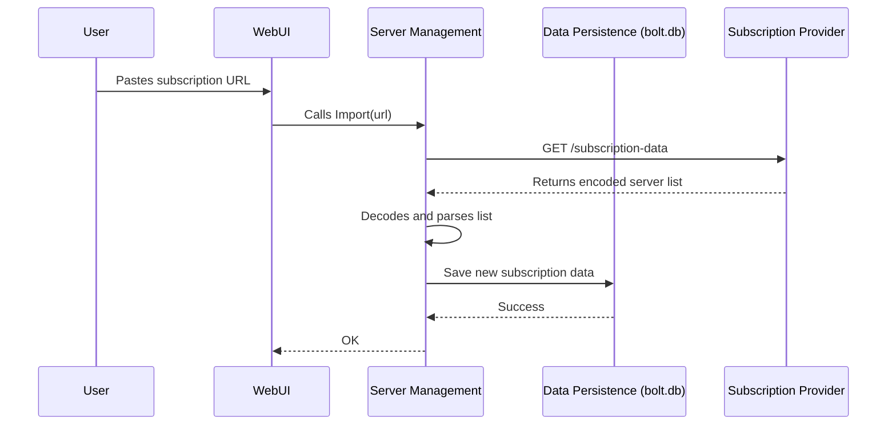

# Chapter 2: Server & Subscription Management

In our [previous chapter](01_data_persistence___configuration_model_.md), we learned how v2rayA uses a "notebook" (`bolt.db`) and "blueprints" (`structs`) to remember its settings. We now understand the *how* of saving data. In this chapter, we'll explore the *what*—specifically, how v2rayA manages its most important inventory: the proxy servers you use to connect to the internet.

Imagine you're a librarian. Your job isn't just to have a library; it's to manage the books. You need to add new books, receive new magazine issues, and remove old or damaged ones. v2rayA's **Server & Subscription Management** system is exactly like that librarian, but for proxy servers.

This system's job is to handle all operations related to your server list, making sure it's always organized and up-to-date.

## The Core Task: Getting Servers into v2rayA

Let's start with a simple goal: you have a new proxy server and you want to add it to v2rayA. You've been given a special link that looks something like `vmess://...` or `ss://...`. How does v2rayA take this link and turn it into a usable server entry in its list?

This is the primary job of our "librarian." It needs to be able to handle two main types of "acquisitions":
1.  **A Single Server:** Adding one server from a single link.
2.  **A Subscription:** Adding a whole collection of servers from a single subscription URL.

Let's see how it handles both.

### Adding a Single Server

When you paste a single server link and click "Import," v2rayA needs to parse it, understand its details (address, port, protocol), and save it.

The main entry point for this is the `Import` function.

```go
// File: service/server/service/import.go

func Import(url string, /*...*/) (err error) {
	// Check if the link looks like a standard server protocol
	if common.HasAnyPrefix(url, []string{"vmess://", "ss://", /*...*/}) {
		// It's a single server! Let's parse it.
		var obj serverObj.ServerObj
		obj, err = ResolveURL(url)
		if err != nil {
			return // Failed to understand the link
		}
		
		// Now, save this new server to our database "notebook"
		err = configure.AppendServers([]*configure.ServerRaw{{ServerObj: obj}})
	} else {
		// It's not a single server link, so it must be a subscription.
		// (We'll cover this next!)
	}
	return
}
```
This code is quite straightforward:
1.  It checks if the `url` starts with a known protocol like `vmess://`.
2.  If it does, it calls `ResolveURL` to decode the link into a structured `ServerObj` (our "blueprint" for a server).
3.  Finally, it calls `configure.AppendServers` to add this new server to the list we store in `bolt.db`, just as we learned in Chapter 1.

### Adding a Subscription

Adding servers one-by-one is fine, but what if your provider gives you a single link that contains *hundreds* of servers? This is a **subscription**.

Think of it like this: a single server link is like buying one book. A subscription is like signing up for a magazine—you get a whole collection, and it even gets updated over time!

When the `Import` function sees a link that isn't a direct server link (the `else` block in our code above), it treats it as a subscription.

```go
// File: service/server/service/import.go (The 'else' part)

// ...
} else {
	// This looks like a subscription. Let's process it.
	c := httpClient.GetHttpClientAutomatically()
	
	// Fetch the server list from the subscription URL
	infos, status, err := ResolveSubscriptionWithClient(source, c)
	if err != nil {
		return // Failed to get data from the URL
	}

	// Save the entire subscription (address, servers, status) to the database
	err = configure.AppendSubscriptions(/*... a new subscription object ...*/)
}
// ...
```
Here, the process is a bit different:
1.  It calls `ResolveSubscriptionWithClient`, a helper function designed to handle subscription URLs.
2.  This helper fetches the content, decodes it (it's usually in a special format like Base64), and parses it into a list of individual servers.
3.  Finally, it calls `configure.AppendSubscriptions` to save the *entire subscription*—including its URL and the list of servers it contains—to the database.

## Keeping the Shelves Stocked: Updating Subscriptions

Magazines release new issues. Likewise, subscription server lists change. A good librarian periodically checks for new issues. v2rayA does the same by updating your subscriptions.

When you click the "Update" button on a subscription, v2rayA runs the `UpdateSubscription` function.

```go
// File: service/server/service/subscription.go

func UpdateSubscription(index int, /*...*/) (err error) {
	// 1. Get the subscription's address from the database
	addr := configure.GetSubscriptions()[index].Address

	// 2. Fetch the new, updated list of servers from that address
	newServers, _, err := ResolveSubscriptionWithClient(addr, /*...*/)
	if err != nil {
		return
	}
	
	// 3. Intelligently merge the new list with the old one,
	//    preserving your connection if possible.

	// 4. Save the updated subscription back to the database
	return configure.SetSubscription(index, /*... the updated subscription ...*/)
}
```
This is a critical feature. It doesn't just blindly replace the list. It's smart about it. For example, if you are currently connected to a server from that subscription and that server *still exists* in the new list, v2rayA will seamlessly update your connection to point to the (potentially updated) server in the new list, avoiding a disconnection.

## How It All Works: The Journey of a Subscription Link

Let's trace the journey of adding a new subscription from start to finish.

1.  **You:** Paste a subscription URL into the v2rayA web interface.
2.  **API Server:** The browser sends this URL to the v2rayA backend. (We'll learn about this in the [API Server & Controllers](03_api_server___controllers_.md) chapter).
3.  **Server Management:** The controller calls our `Import` function.
4.  **Fetching:** `Import` sees it's a subscription and tells `ResolveSubscriptionWithClient` to fetch the data from the remote provider's server.
5.  **Parsing:** The function gets a long string of encoded text, decodes it, and splits it into individual server links. It then parses each link into a `ServerObj`.
6.  **Saving:** It bundles all these `ServerObj`s into a `SubscriptionRaw` struct and uses the functions from our [Data Persistence](01_data_persistence___configuration_model_.md) chapter to save it permanently in `bolt.db`.

Here is a diagram of the process:



## Tidying Up: Deleting Servers

Finally, a librarian needs to clear out old books. The `DeleteWhich` function is v2rayA's tool for this.

```go
// File: service/server/service/touch.go

func DeleteWhich(ws []*configure.Which) (err error) {
	// ... (Code to sort and de-duplicate the items to be deleted) ...

	for _, v := range touches {
		switch v.TYPE {
		case configure.SubscriptionType: // Deleting a whole subscription
			// If we are connected to a server in this subscription, disconnect first.
			// ...
			// Then remove the subscription from the database.
			// ...
		case configure.ServerType: // Deleting a single server
			// If we are connected to this server, disconnect first.
			// ...
			// Then remove the server from the database.
			// ...
		}
	}
	return
}
```

This function is careful. Before it deletes anything, it checks if you are currently connected using that server or a server from that subscription. If you are, it disconnects you safely before removing the entry from the database. This prevents the application from getting into a confusing state where it's connected to a server that no longer exists in its list.

## Conclusion

In this chapter, we've met the "librarian" of v2rayA—the Server & Subscription Management system.

-   **It's an Inventory Manager:** Its sole purpose is to handle the lifecycle of servers and subscriptions.
-   **It Handles Imports:** It can parse both single server links and full subscription URLs, adding them to the database.
-   **It Keeps Things Fresh:** It updates subscriptions by re-fetching server lists and intelligently merging them.
-   **It Cleans Up:** It safely deletes servers and subscriptions, managing active connections as needed.

This system is the bridge between a user's intent ("I want to add this server") and the underlying [Data Persistence & Configuration Model](01_data_persistence___configuration_model_.md).

Now that we know how servers get into v2rayA, how does the user's click on the "Import" button actually trigger these functions? In the next chapter, we'll look at the system that listens for user actions.

Next: [Chapter 3: API Server & Controllers](03_api_server___controllers_.md)

---

Generated by [AI Codebase Knowledge Builder](https://github.com/The-Pocket/Tutorial-Codebase-Knowledge)